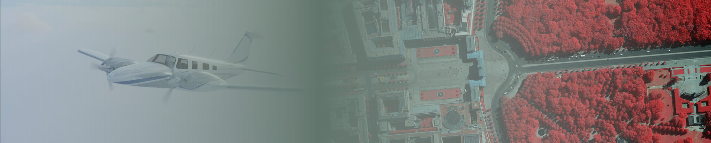

# ULTRACOR: Radiometric Atmospheric Correction Plugin for QGIS



## Overview

**ULTRACOR** is a QGIS plugin designed to perform radiometric atmospheric corrections on satellite imagery. Developed by GeoWay, this plugin provides an efficient and user-friendly interface for adjusting satellite imagery data, making it suitable for scientific and practical applications in remote sensing.

## Objective

The main objective of ULTRACOR is to enable users to apply radiometric corrections to satellite images, thus improving the accuracy of the data by correcting the influence of atmospheric effects. This plugin is ideal for professionals and researchers in geospatial fields who require precise and corrected data for further analysis.

## Features

- **File Selection**: Load satellite imagery directly into QGIS.
- **Band Selection**: Choose specific bands (Blue, Green, Red, NIR) for correction.
- **Correction Parameters**: Input solar irradiance, offset, and scale factor values for each band.
- **Radiometric Correction**: Perform atmospheric correction using user-defined parameters.
- **Progress Tracking**: Monitor the progress of the correction process in real-time.
- **Result Export**: Save the corrected imagery as a new file.
- **Integration with QGIS**: Seamlessly load and visualize the corrected imagery in QGIS.

## Theoretical Background

Radiometric atmospheric correction is essential in remote sensing to adjust the reflectance values of satellite images, accounting for the scattering and absorption caused by the Earth's atmosphere. Without such corrections, the data obtained from satellites might not accurately represent the surface characteristics, leading to potential errors in analysis.

### Key Concepts:

1. **Solar Irradiance**: The power per unit area received from the Sun in the form of electromagnetic radiation.
2. **Offset and Scale Factor**: Parameters used to adjust the digital numbers (DN) of the image to physical values.
3. **Band Selection**: The process involves selecting specific wavelength bands (e.g., Blue, Green, Red, NIR) that correspond to different portions of the electromagnetic spectrum.

## Installation

1. **Clone the Repository**:
    ```sh
    git clone https://github.com/YourUsername/ULTRACOR.git
    ```

2. **Install the Plugin**:
    - Copy the plugin folder to your QGIS plugins directory:
      - Windows: `C:\Users\YourUsername\AppData\Roaming\QGIS\QGIS3\profiles\default\python\plugins`
      - macOS: `~/Library/Application Support/QGIS/QGIS3/profiles/default/python/plugins`
      - Linux: `~/.local/share/QGIS/QGIS3/profiles/default/python/plugins`
    - Restart QGIS.

3. **Activate the Plugin**:
    - Go to `Plugins > Manage and Install Plugins`.
    - Search for "ULTRACOR" and enable it.

## Usage

### Step-by-Step Guide

1. **Launch ULTRACOR**:
   - Go to `Raster > ULTRACOR` to open the plugin interface.

2. **Load Satellite Image**:
   - Click on the "Select File" button to browse and load your satellite image into the plugin.
   - The bands of the image will be automatically populated in the drop-down lists.

3. **Configure Band Parameters**:
   - For each band (Blue, Green, Red, NIR), select the band index, input the solar irradiance, offset, and scale factor.
   - The NIR band is optional and can be set to "N/A" if not applicable.

4. **Save Output File**:
   - Choose a destination to save the corrected image using the "Save File" button.

5. **Perform Correction**:
   - Click "OK" to start the radiometric correction. The progress will be displayed in the progress bar.
   - The corrected image will be automatically loaded into QGIS upon completion.

6. **Load Image in QGIS**:
   - Use the "Load Image" button to visualize the selected image in QGIS.

### Example Workflow

1. **Select a Landsat image** and load it into the plugin.
2. **Configure the parameters** for each band using pre-calculated solar irradiance values.
3. **Run the correction** and save the output as "corrected_image.tif".
4. **Visualize the corrected image** in QGIS and continue with further analysis.

## Dependencies

- **QGIS 3.x**
- **GDAL**: Required for image processing.
- **Python 3.x**: Used for scripting within QGIS.

## References

- [Chavez, P. S. (1996). Image-Based Atmospheric Corrections](https://www.sciencedirect.com/science/article/pii/S0034425796000953)
- [Gao, B.-C. (1996). Atmospheric correction algorithms](https://www.osapublishing.org/ao/fulltext.cfm?uri=ao-35-15-2699&id=145358)
- [QGIS Documentation](https://docs.qgis.org/)

## License

ULTRACOR is licensed under the [Apache License 2.0](https://www.apache.org/licenses/LICENSE-2.0).

